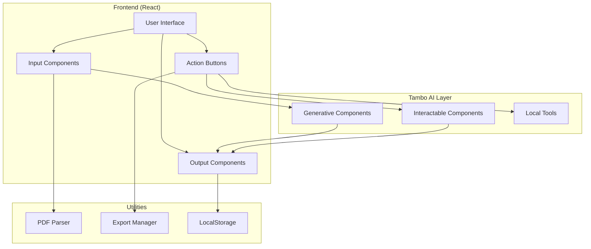
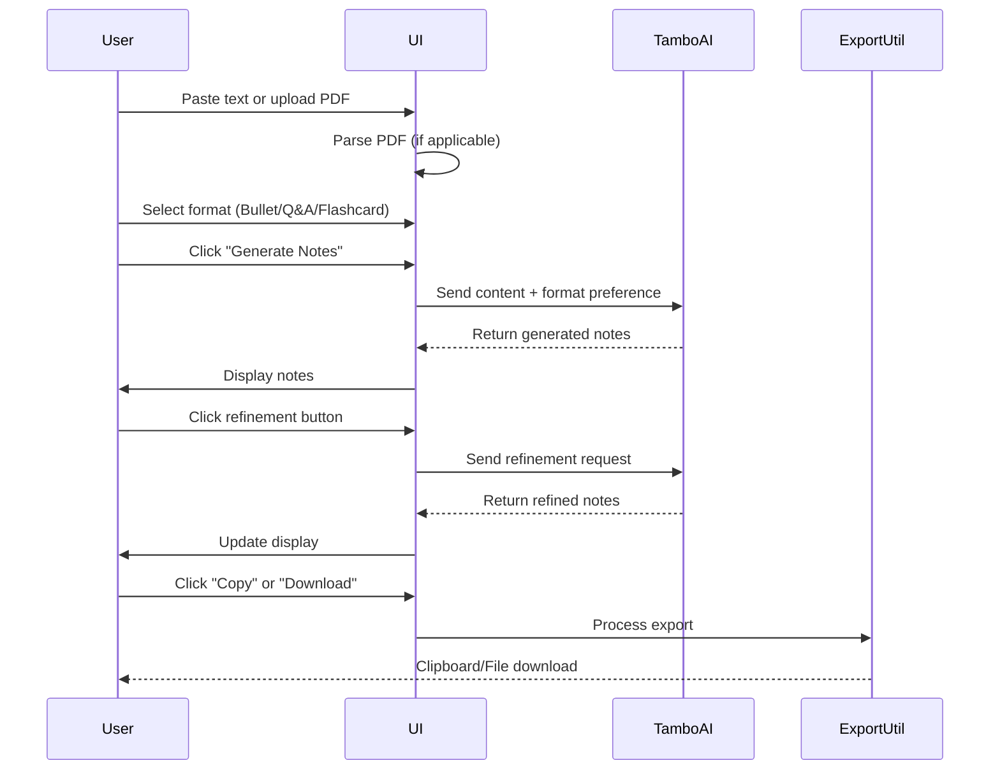
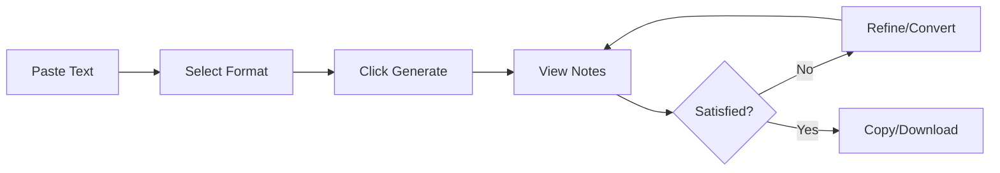
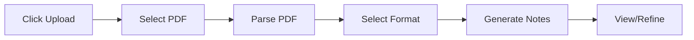

# Product Requirements Document: SnapNotes AI

## Document Information

| Field | Value |
|-------|-------|
| **Project Name** | SnapNotes AI |
| **Version** | 1.0 |
| **Last Updated** | February 8, 2026 |
| **Status** | Draft |
| **Document Owner** | Product Team |

---

## 1. Executive Summary

### 1.1 Problem Statement

Students invest significant time reading lengthy PDFs, academic articles, and comprehensive notes, often struggling to distill essential information for exam preparation. This inefficiency leads to:

- **Time Wastage**: Hours spent on content that could be condensed
- **Information Overload**: Difficulty identifying key concepts and exam-relevant material
- **Poor Retention**: Long-form content is harder to memorize and recall
- **Last-Minute Stress**: Insufficient time to review all material before exams

### 1.2 Solution Overview

SnapNotes AI is an AI-powered web application that transforms lengthy academic content (text and PDFs) into concise, exam-oriented micro-notes in multiple formats. Leveraging Tambo AI's interactive components, the application provides:

- **Instant Summarization**: Convert long content into focused, exam-ready notes
- **Multiple Formats**: Bullet notes, Q&A, and flashcards for diverse learning styles
- **Interactive Refinement**: Real-time adjustments to note length and detail level
- **Easy Export**: Download or copy notes for offline study

### 1.3 Success Metrics

| Metric | Target (3 months) | Measurement Method |
|--------|-------------------|-------------------|
| User Adoption | 1,000+ active users | Analytics tracking |
| Processing Speed | < 10 seconds for 10-page PDF | Performance monitoring |
| User Satisfaction | 4.5+ star rating | User feedback surveys |
| Conversion Rate | 60% of visitors create notes | Funnel analysis |
| Retention Rate | 40% weekly active users | Cohort analysis |

---

## 2. Product Vision & Goals

### 2.1 Vision Statement

To become the go-to AI-powered study companion that empowers students to learn more efficiently by transforming complex academic content into personalized, exam-ready micro-notes.

### 2.2 Product Goals

#### Primary Goals
1. **Deliver MVP in 1 day** suitable for competition submission
2. **Showcase Tambo AI capabilities** across all component types
3. **Provide immediate value** to students preparing for exams
4. **Enable seamless user experience** with minimal learning curve

#### Secondary Goals
1. Support multiple academic disciplines
2. Build foundation for future premium features
3. Establish brand recognition in ed-tech space
4. Gather user feedback for iterative improvements

### 2.3 Target Audience

#### Primary Users
- **University Students** (18-25 years)
  - Preparing for midterms and finals
  - Need quick revision materials
  - Tech-savvy, comfort with web applications

- **High School Students** (15-18 years)
  - Studying for standardized tests
  - Prefer visual learning aids
  - Mobile-first users

#### Secondary Users
- **Professionals** preparing for certification exams
- **Self-learners** consuming online courses
- **Educators** creating study materials for students

---

## 3. Core Features & Requirements

### 3.1 Feature Priority Matrix

| Priority | Feature | MVP | Post-MVP |
|----------|---------|-----|----------|
| P0 (Must-Have) | Text input & PDF upload | ✓ | |
| P0 (Must-Have) | AI note generation | ✓ | |
| P0 (Must-Have) | Format selection (Bullet/Q&A/Flashcards) | ✓ | |
| P0 (Must-Have) | Interactive controls (Shorter/Detailed) | ✓ | |
| P0 (Must-Have) | Export & copy functionality | ✓ | |
| P1 (Should-Have) | PDF parsing | ✓ | |
| P1 (Should-Have) | LocalStorage for history | | ✓ |
| P2 (Nice-to-Have) | Multi-language support | | ✓ |
| P2 (Nice-to-Have) | User accounts | | ✓ |
| P2 (Nice-to-Have) | Collaborative notes | | ✓ |

### 3.2 Detailed Feature Specifications

#### Feature 1: Input Section

**Description**: Allow users to provide content for note generation through multiple input methods.

**User Stories**:
- As a student, I want to paste text directly so I can quickly generate notes from online articles
- As a student, I want to upload PDF files so I can convert lecture slides into study notes
- As a student, I want to select my preferred note style upfront so the AI generates appropriate format

**Functional Requirements**:

| ID | Requirement | Priority |
|----|-------------|----------|
| IN-001 | Support plaintext input via textarea (max 50,000 characters) | P0 |
| IN-002 | Support PDF upload (max 10MB, .pdf format only) | P1 |
| IN-003 | Provide format selector with 3 options: Bullet Notes, Q&A, Flashcards | P0 |
| IN-004 | Display character/page count for input validation | P1 |
| IN-005 | Show loading state during PDF parsing | P1 |
| IN-006 | Clear input button to reset the form | P1 |

**Acceptance Criteria**:
- ✓ User can paste text and see character count update in real-time
- ✓ User can upload a PDF and see parsing progress
- ✓ User can switch between format options before generation
- ✓ Error messages display for invalid inputs (file too large, unsupported format)

**Technical Specifications**:
```javascript
// Component: TextInput.jsx
- Props: { value, onChange, maxLength, placeholder }
- State: inputText, charCount
- Validation: character limit, empty input check

// Component: PDFUploader.jsx
- Props: { onFileSelect, maxSize }
- State: file, isUploading, uploadProgress
- Library: pdfjs-dist or react-pdf
- Output: extracted plain text
```

---

#### Feature 2: AI Note Generation

**Description**: Leverage Tambo AI generative components to create concise, exam-oriented notes from input content.

**User Stories**:
- As a student, I want AI-generated summaries that focus on key concepts so I can study efficiently
- As a student, I want definitions and important terms highlighted so I can identify critical information
- As a student, I want exam-friendly language so the notes match my study needs

**Functional Requirements**:

| ID | Requirement | Priority |
|----|-------------|----------|
| NG-001 | Generate bullet-point notes with key concepts, definitions, and examples | P0 |
| NG-002 | Generate Q&A format with questions and detailed answers | P0 |
| NG-003 | Generate flashcards with front (question/term) and back (answer/definition) | P0 |
| NG-004 | Process generation within 10 seconds for typical input | P0 |
| NG-005 | Highlight definitions and key terms in output | P1 |
| NG-006 | Maintain academic accuracy and factual correctness | P0 |

**Acceptance Criteria**:
- ✓ Generated notes are significantly shorter than original (60-80% reduction)
- ✓ Notes focus on exam-relevant content (definitions, formulas, key concepts)
- ✓ Output is grammatically correct and well-formatted
- ✓ Generation completes within acceptable time limits

**Tambo AI Integration**:
```javascript
// Generative Component Configuration
Tambo.GenerativeNote({
  input: userContent,
  format: selectedFormat, // bullet, qa, flashcard
  parameters: {
    conciseness: "high",
    focusAreas: ["definitions", "key_points", "examples"],
    tone: "exam-friendly",
    maxLength: 2000
  }
})
```

---

#### Feature 3: Interactive Controls

**Description**: Provide Tambo AI interactable components for real-time note refinement and format conversion.

**User Stories**:
- As a student, I want to make notes shorter when I need quick revision
- As a student, I want to make notes more detailed when I need deeper understanding
- As a student, I want to convert between formats without re-uploading content
- As a student, I want instant updates when I refine notes

**Functional Requirements**:

| ID | Requirement | Priority |
|----|-------------|----------|
| IC-001 | "Shorter" button: reduces note length by ~30% | P0 |
| IC-002 | "More Detailed" button: expands notes with examples and context | P0 |
| IC-003 | "Convert to Q&A" button: transforms any format to Q&A | P0 |
| IC-004 | "Make Flashcards" button: converts any format to flashcards | P0 |
| IC-005 | Display loading state during refinement (< 5 seconds) | P0 |
| IC-006 | Maintain history of refinements (undo functionality) | P2 |

**Acceptance Criteria**:
- ✓ Each button triggers appropriate AI transformation
- ✓ Refinement preserves core information accuracy
- ✓ User can switch between all formats seamlessly
- ✓ Loading indicators show during processing

**UI/UX Specifications**:
```jsx
// ActionButtons Component
<div className="flex gap-4 justify-center mt-6">
  <TamboInteractableButton 
    action="condense" 
    label="✂️ Shorter"
    variant="secondary"
  />
  <TamboInteractableButton 
    action="expand" 
    label="📖 More Detailed"
    variant="secondary"
  />
  <TamboInteractableButton 
    action="convertQA" 
    label="❓ Convert to Q&A"
    variant="primary"
  />
  <TamboInteractableButton 
    action="convertFlashcard" 
    label="🎴 Make Flashcards"
    variant="primary"
  />
</div>
```

---

#### Feature 4: Export & Copy

**Description**: Enable users to export or copy generated notes for offline use and integration with study tools.

**User Stories**:
- As a student, I want to copy notes to my clipboard so I can paste them into my note-taking app
- As a student, I want to download notes as PDF so I can read them offline
- As a student, I want to download notes as TXT so I can edit them later

**Functional Requirements**:

| ID | Requirement | Priority |
|----|-------------|----------|
| EX-001 | "Copy to Clipboard" button with success feedback | P0 |
| EX-002 | Download as .txt file with proper formatting | P0 |
| EX-003 | Download as .pdf file with clean layout | P1 |
| EX-004 | Preserve formatting (bold, italics, bullet points) in exports | P1 |
| EX-005 | Include metadata in export (date, original source name) | P2 |

**Acceptance Criteria**:
- ✓ Copy button copies formatted text to clipboard
- ✓ Success message appears after copy action
- ✓ Downloaded files maintain readability and structure
- ✓ File names include timestamp and note type

**Technical Implementation**:
```javascript
// utils/exportNotes.js

export const copyToClipboard = async (text) => {
  await navigator.clipboard.writeText(text);
  // Show toast notification
};

export const downloadTXT = (content, filename) => {
  const blob = new Blob([content], { type: 'text/plain' });
  const url = URL.createObjectURL(blob);
  downloadFile(url, `${filename}.txt`);
};

export const downloadPDF = (content, filename) => {
  // Use jsPDF or html2pdf library
  const pdf = generatePDF(content);
  pdf.save(`${filename}.pdf`);
};
```

---

## 4. Technical Architecture

### 4.1 Technology Stack

#### Frontend (Primary Layer)

| Technology | Purpose | Justification |
|------------|---------|---------------|
| **React.js 18+** | UI Framework | Required for Tambo React SDK; component-based architecture; extensive ecosystem |
| **Vite** | Build Tool | Fast HMR; optimized builds; modern dev experience |
| **Tailwind CSS** | Styling | Rapid UI development; consistent design system; minimal custom CSS |
| **React Router** | Navigation | (Post-MVP) Multi-page routing for user accounts |

#### AI Layer (Core Intelligence)

| Technology | Purpose | Implementation |
|------------|---------|----------------|
| **Tambo AI React SDK** | AI Components | Primary AI integration |
| **Generative Components** | Note Creation | Content summarization and formatting |
| **Interactable Components** | Refinement Controls | Format conversion and detail adjustment |

#### Document Handling

| Technology | Purpose | Priority |
|------------|---------|----------|
| **pdfjs-dist** | PDF Parsing | P1 - Extract text from PDFs |
| **react-pdf** | PDF Viewer | P2 - Preview uploaded PDFs |

#### Local Tools & Browser APIs

| Technology | Purpose | Browser Support |
|------------|---------|-----------------|
| **Clipboard API** | Copy notes | 95%+ modern browsers |
| **File Saver / Blob API** | Download exports | All modern browsers |
| **LocalStorage** | Save history | All browsers |

### 4.2 System Architecture Diagram



### 4.3 Application Structure

```
ai-micronotes/
├─ public/
│   ├─ favicon.ico
│   └─ logo.svg
├─ src/
│   ├─ components/
│   │   ├─ TextInput.jsx          # Text area for pasting content
│   │   ├─ PDFUploader.jsx         # PDF file upload component
│   │   ├─ FormatSelector.jsx      # Note format selection
│   │   ├─ NotesOutput.jsx         # Display generated notes
│   │   ├─ ActionButtons.jsx       # Refinement controls
│   │   ├─ ExportButtons.jsx       # Export and copy options
│   │   └─ LoadingSpinner.jsx      # Loading states
│   ├─ pages/
│   │   └─ Home.jsx                # Main application page
│   ├─ utils/
│   │   ├─ exportNotes.js          # Export functionality
│   │   ├─ pdfParser.js            # PDF text extraction
│   │   └─ localStorage.js         # Local storage management
│   ├─ hooks/
│   │   ├─ useTamboAI.js           # Tambo AI integration hook
│   │   └─ useLocalStorage.js      # LocalStorage hook
│   ├─ styles/
│   │   └─ globals.css             # Global Tailwind styles
│   ├─ App.jsx                     # Root component
│   └─ main.jsx                    # Entry point
├─ .env.local                      # Environment variables (Tambo API key)
├─ package.json
├─ vite.config.js
├─ tailwind.config.js
└─ README.md
```

### 4.4 Data Flow



### 4.5 Tambo AI Integration Strategy

| Tambo Feature | Usage in SnapNotes AI | Implementation Component |
|---------------|------------------------|--------------------------|
| **React SDK** | Entire UI framework | All components |
| **Generative Components** | Initial note creation from text/PDF | `NotesOutput.jsx`, `useTamboAI.js` |
| **Interactable Components** | Format switching, refinement controls | `ActionButtons.jsx` |
| **Local Tools** | Export, copy, save functionality | `ExportButtons.jsx`, `utils/` |
| **MCP Integrations** | (Optional) Advanced PDF parsing | `pdfParser.js` |

**Why This Demonstrates Tambo Well**:
1. ✅ Uses generative AI for content transformation (core value prop)
2. ✅ Leverages interactable components for real-time refinement (unique capability)
3. ✅ Integrates local tools for practical utility (complete solution)
4. ✅ Shows clear before/after transformation (visual proof of AI value)

---

## 5. User Interface & Experience

### 5.1 Design Principles

1. **Simplicity**: Minimal learning curve, intuitive workflows
2. **Speed**: Fast interactions, instant feedback
3. **Clarity**: Clear visual hierarchy, readable typography
4. **Responsiveness**: Works on desktop, tablet, and mobile
5. **Accessibility**: WCAG 2.1 AA compliance

### 5.2 Layout Structure

#### Desktop View (1920x1080)
```
┌──────────────────────────────────────────────────────┐
│  Header: SnapNotes AI | Turn Long Content into        │
│          Exam-Ready Micro-Notes                      │
├───────────────────┬──────────────────────────────────┤
│                   │                                  │
│  LEFT PANEL       │  RIGHT PANEL                     │
│  (Input)          │  (Output)                        │
│                   │                                  │
│  📄 Paste Text    │  📝 Generated Notes              │
│  [Text Area]      │  [Notes Display]                 │
│                   │                                  │
│  📎 Upload PDF    │  Format: Bullet Notes ▼          │
│  [File Upload]    │                                  │
│                   │  ───────────────────────────     │
│  Format:          │  • Key Point 1                   │
│  ○ Bullet Notes   │  • Key Point 2                   │
│  ○ Q&A            │  • Key Point 3                   │
│  ○ Flashcards     │                                  │
│                   │                                  │
│  [Generate Notes] │                                  │
│                   │                                  │
├───────────────────┴──────────────────────────────────┤
│  BOTTOM BAR: Action Buttons                          │
│  [✂️ Shorter] [📖 More Detailed]                     │
│  [❓ Convert to Q&A] [🎴 Make Flashcards]            │
│  [📋 Copy] [⬇️ Download TXT] [⬇️ Download PDF]      │
└──────────────────────────────────────────────────────┘
```

#### Mobile View (375x667)
```
┌───────────────────────┐
│  SnapNotes AI         │
├───────────────────────┤
│  📄 Paste or Upload   │
│  [Text Area]          │
│  [Upload PDF]         │
│                       │
│  Format: Bullet ▼     │
│  [Generate]           │
├───────────────────────┤
│  📝 Your Notes        │
│  • Key Point 1        │
│  • Key Point 2        │
├───────────────────────┤
│  [Shorter] [Detailed] │
│  [Q&A] [Flashcards]   │
│  [Copy] [Download]    │
└───────────────────────┘
```

### 5.3 Color Scheme & Styling

```css
/* Tailwind Config - Color Palette */
colors: {
  primary: {
    50: '#f0f9ff',
    500: '#3b82f6',  // Primary blue
    700: '#1d4ed8',
  },
  accent: {
    500: '#10b981',  // Success green
    600: '#059669',
  },
  neutral: {
    100: '#f3f4f6',  // Light background
    800: '#1f2937',  // Dark text
    900: '#111827',  // Headings
  }
}
```

### 5.4 Typography

- **Headings**: Inter (Sans-serif, weights: 600, 700)
- **Body**: Inter (weights: 400, 500)
- **Code/Monospace**: JetBrains Mono

### 5.5 Component Specifications

#### Button Styles
```jsx
// Primary Button (Generate, Convert)
className="bg-primary-500 hover:bg-primary-700 text-white font-medium py-3 px-6 rounded-lg transition-all duration-200 shadow-md hover:shadow-lg"

// Secondary Button (Shorter, Detailed)
className="bg-neutral-100 hover:bg-neutral-200 text-neutral-800 font-medium py-2 px-4 rounded-md transition-colors duration-200"

// Icon Button (Copy, Download)
className="p-2 rounded-full hover:bg-neutral-100 transition-colors"
```

### 5.6 User Flows

#### Flow 1: Generate Notes from Text


#### Flow 2: Upload PDF


---

## 6. Non-Functional Requirements

### 6.1 Performance

| Requirement | Target | Measurement |
|-------------|--------|-------------|
| Page Load Time | < 2 seconds | Lighthouse score |
| Note Generation | < 10 seconds | API response time |
| Refinement Speed | < 5 seconds | Component render time |
| PDF Parsing | < 15 seconds (10-page doc) | Processing time |
| Export Generation | < 3 seconds | File creation time |

### 6.2 Scalability

- **Concurrent Users**: Support 100+ simultaneous users (MVP)
- **Input Size**: Handle documents up to 50,000 characters or 10MB PDF
- **API Rate Limits**: Respect Tambo AI rate limits (implement queuing if needed)

### 6.3 Security

- **API Key Protection**: Store Tambo API key in environment variables (`.env.local`)
- **Input Validation**: Sanitize user input to prevent XSS attacks
- **File Upload Security**: Validate file types and sizes on client-side
- **HTTPS Only**: Serve application over HTTPS in production

### 6.4 Reliability

- **Uptime**: 99%+ availability (dependent on Tambo AI uptime)
- **Error Handling**: Graceful degradation with user-friendly error messages
- **Data Persistence**: LocalStorage fallback if server unavailable

### 6.5 Accessibility

- **WCAG 2.1 Level AA** compliance
- **Keyboard Navigation**: All features accessible via keyboard
- **Screen Reader Support**: Proper ARIA labels and semantic HTML
- **Color Contrast**: Minimum 4.5:1 for normal text
- **Focus Indicators**: Visible focus states for all interactive elements

### 6.6 Browser Compatibility

| Browser | Minimum Version |
|---------|-----------------|
| Chrome | 90+ |
| Firefox | 88+ |
| Safari | 14+ |
| Edge | 90+ |

### 6.7 Responsive Design Breakpoints

- **Mobile**: 320px - 767px
- **Tablet**: 768px - 1023px
- **Desktop**: 1024px+

---

## 7. Competitive Analysis

### 7.1 Competitor Comparison

| Feature | SnapNotes AI | QuillBot Summarizer | Resoomer | ChatGPT |
|---------|---------------|---------------------|----------|---------|
| **PDF Upload** | ✅ | ❌ | ✅ | ✅ (Plus) |
| **Multiple Formats** | ✅ (3 types) | ❌ | ❌ | ⚠️ (Manual) |
| **Interactive Refinement** | ✅ | ⚠️ (Limited) | ❌ | ✅ |
| **Flashcard Generation** | ✅ | ❌ | ❌ | ⚠️ (Manual) |
| **Exam Focus** | ✅ | ❌ | ⚠️ | ❌ |
| **Export Options** | ✅ (TXT, PDF) | ✅ | ✅ | ❌ (Copy only) |
| **Free Tier** | ✅ | ⚠️ (Limited) | ⚠️ (Limited) | ✅ (Limited) |
| **No Account Required** | ✅ | ❌ | ❌ | ❌ |

### 7.2 Unique Value Propositions

1. **Purpose-Built for Students**: Exam-oriented language and formats
2. **Multiple Learning Styles**: Bullet notes, Q&A, and flashcards in one tool
3. **Instant Refinement**: Real-time adjustments without re-processing
4. **Zero Friction**: No account required, instant usage
5. **Tambo AI Integration**: Cutting-edge AI capabilities with interactable components

---

## 8. Development Timeline

### 8.1 MVP Development (1 Day Sprint)

| Time Block | Tasks | Deliverables |
|------------|-------|--------------|
| **Hours 0-2** | Project setup, dependencies | Vite + React + Tailwind initialized |
| **Hours 2-4** | Tambo AI integration, core components | `useTamboAI` hook, basic UI structure |
| **Hours 4-6** | Input components, PDF parsing | `TextInput`, `PDFUploader` functional |
| **Hours 6-8** | Note generation, format selection | Generative component working |
| **Hours 8-10** | Interactive controls, refinement | All action buttons functional |
| **Hours 10-12** | Export functionality, styling polish | Copy/download working, UI refined |
| **Hours 12-14** | Testing, bug fixes, documentation | README, demo video, submission ready |

### 8.2 Post-MVP Roadmap

#### Phase 1 (Week 1-2): Polish & Optimization
- LocalStorage implementation for note history
- Performance optimization (lazy loading, code splitting)
- Enhanced error handling and user feedback
- Mobile responsiveness improvements

#### Phase 2 (Week 3-4): Enhanced Features
- User accounts and authentication
- Save and organize multiple note sets
- Custom formatting preferences
- Share notes via link

#### Phase 3 (Month 2): Advanced AI Features
- Multi-language support
- Subject-specific templates (Math, History, Science)
- Diagram and image extraction from PDFs
- AI-powered practice quizzes

---

## 9. Testing Strategy

### 9.1 Testing Pyramid

```
        /\
       /  \  E2E Tests (10%)
      /────\
     / In   \ Integration Tests (30%)
    /────────\
   / Tegra    \ Unit Tests (60%)
  /────────────\
```

### 9.2 Test Cases

#### Unit Tests
- ✓ PDF parser extracts text correctly
- ✓ Export functions generate valid files
- ✓ Format selector updates state
- ✓ Input validation catches errors

#### Integration Tests
- ✓ Tambo AI returns expected note formats
- ✓ Refinement buttons trigger correct transformations
- ✓ Export buttons create downloadable files
- ✓ LocalStorage saves and retrieves notes

#### End-to-End Tests
- ✓ User pastes text → generates bullet notes → downloads PDF
- ✓ User uploads PDF → converts to Q&A → copies to clipboard
- ✓ User refines notes multiple times → exports as TXT
- ✓ Error handling when API fails

### 9.3 Testing Tools
- **Vitest**: Unit and integration testing
- **React Testing Library**: Component testing
- **Playwright** (Post-MVP): E2E testing

---

## 10. Risks & Mitigation

| Risk | Impact | Probability | Mitigation Strategy |
|------|--------|-------------|---------------------|
| **Tambo AI API Downtime** | High | Low | Implement retry logic, cache previous results |
| **PDF Parsing Failures** | Medium | Medium | Fallback to text-only mode, clear error messages |
| **Slow Processing Times** | Medium | Medium | Add loading indicators, optimize prompts |
| **Inaccurate Note Generation** | High | Low | Test with diverse content, refine prompts |
| **Browser Compatibility Issues** | Low | Medium | Test on all major browsers, polyfills |
| **Exceeding API Rate Limits** | Medium | Low | Implement client-side queuing, usage analytics |

---

## 11. Success Criteria & KPIs

### 11.1 Launch Success Metrics (Week 1)

- ✅ Application deploys successfully
- ✅ 90%+ of note generations complete successfully
- ✅ Average processing time < 10 seconds
- ✅ Zero critical bugs reported
- ✅ 50+ unique users

### 11.2 Growth Metrics (Month 1)

| Metric | Target |
|--------|--------|
| Active Users | 500+ |
| Notes Generated | 2,000+ |
| Average Session Duration | 5+ minutes |
| Return User Rate | 30%+ |
| Mobile Traffic | 40%+ |

### 11.3 Quality Metrics

| Metric | Target | Measurement |
|--------|--------|-------------|
| User Satisfaction | 4.5+ / 5 | Post-generation survey |
| Note Accuracy | 85%+ useful | User feedback |
| Export Success Rate | 95%+ | Analytics tracking |
| Error Rate | < 5% | Error logging |

---

## 12. Support & Maintenance

### 12.1 User Support Channels (Post-MVP)
- Email support: support@ai-micronotes.com
- FAQ page with common issues
- In-app help tooltips
- GitHub issues for bug reports

### 12.2 Maintenance Plan
- **Weekly**: Monitor API usage and error logs
- **Bi-weekly**: Review user feedback and feature requests
- **Monthly**: Dependency updates and security patches
- **Quarterly**: Major feature releases

---

## 13. Compliance & Legal

### 13.1 Data Privacy
- **No Data Storage**: User content is not stored on servers (MVP)
- **LocalStorage Only**: All data stays in user's browser
- **Privacy Policy**: Clear disclosure of data handling (Post-MVP with accounts)

### 13.2 Terms of Service
- **Content Ownership**: Users retain ownership of uploaded content
- **AI Limitations**: Disclaimer about AI-generated content accuracy
- **Fair Use**: Educational use only, not for commercial redistribution

---

## 14. Glossary

| Term | Definition |
|------|------------|
| **Micro-Notes** | Condensed, exam-focused notes created from longer content |
| **Tambo AI** | AI platform providing generative and interactable components |
| **Generative Component** | Tambo feature that creates new content (summarization) |
| **Interactable Component** | Tambo feature for real-time content modification |
| **Format** | Style of notes (Bullet, Q&A, Flashcards) |
| **Refinement** | Process of adjusting note length or detail level |
| **Export** | Downloading or copying notes for external use |

---

## 15. Appendices

### Appendix A: API Documentation References
- Tambo AI React SDK: [Insert Link]
- PDF.js Documentation: https://mozilla.github.io/pdf.js/
- Clipboard API: https://developer.mozilla.org/en-US/docs/Web/API/Clipboard_API

### Appendix B: Design Resources
- Figma Mockups: [Insert Link]
- Brand Guidelines: [Insert Link]
- Icon Library: Heroicons (https://heroicons.com/)

### Appendix C: Common Mistakes to Avoid

❌ **Only Building a Chatbot**
- *Why it fails*: Generic chat interface doesn't showcase specialized AI features
- *Solution*: Purpose-built UI with clear input → transformation → output flow

❌ **No Interactivity**
- *Why it fails*: Doesn't demonstrate Tambo's interactable components
- *Solution*: Multiple refinement buttons with real-time updates

❌ **Weak Tambo Integration Explanation**
- *Why it fails*: Judges can't identify Tambo's value-add
- *Solution*: Clearly label Tambo components in UI and documentation

❌ **Over-Engineering Backend**
- *Why it fails*: Wastes time on infrastructure instead of AI features
- *Solution*: Client-side only for MVP, leverage Tambo's cloud capabilities

---

## Document Control

### Version History

| Version | Date | Author | Changes |
|---------|------|--------|---------|
| 0.1 | 2026-02-08 | Product Team | Initial draft outline |
| 1.0 | 2026-02-08 | Product Team | Comprehensive PRD completed |

### Approval Sign-Off

| Role | Name | Signature | Date |
|------|------|-----------|------|
| Product Manager | [Name] | | |
| Engineering Lead | [Name] | | |
| Design Lead | [Name] | | |
| Stakeholder | [Name] | | |

---

**Next Steps**: 
1. Review and approve this PRD
2. Set up development environment
3. Begin MVP sprint following 1-day timeline
4. Schedule daily check-ins during development
5. Prepare demo video and documentation for submission
